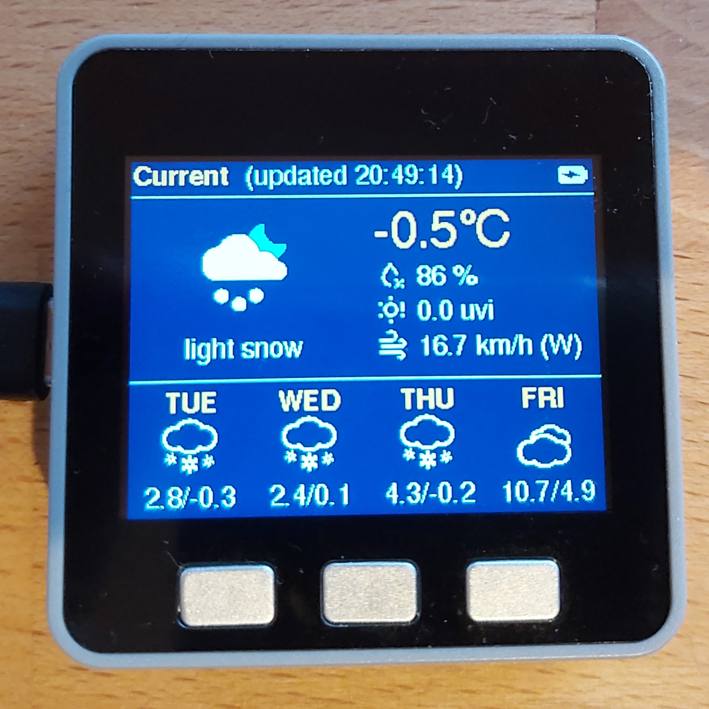
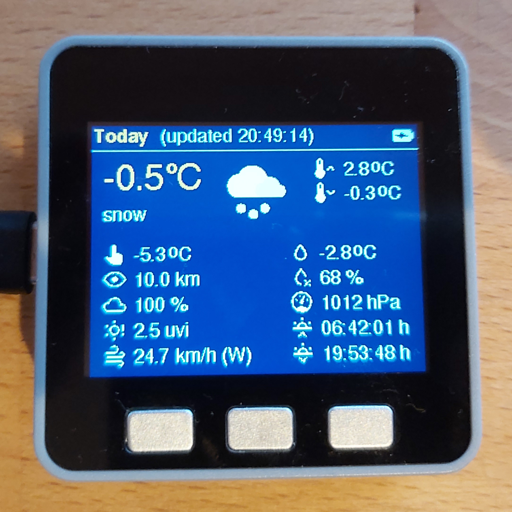
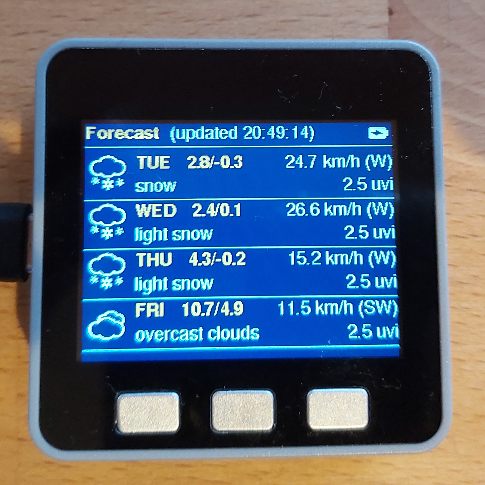

# MettyM5WeatherStation
This program is a weather station for the M5Stack (tested on M5Stack grey). It queries an online service for the weather at a given location and displays it on the M5Stack LCD using several screens. 

## Screenshots

## Usage
Left and right button cycle the different screens, center button
wakes device from sleep or forces a weather refresh, in case of
already awake. Device goes to sleep after some seconds, when not
used for DISPLAY_WAKE_MILLIS. Weather updated is triggered
automatically every UPDATE_INTERVAL_SECS seconds.
   
Compared to other weather station code,
this programm attempts to be different in several ways:
* flicker free update
* color display including icons
* can run on battery for several hours (depending on capacity)
* work around some of the quirks/limitations of M5Stack
** degree "symbol"
** low speaker noise
** flicker-free LCD init from sleep
** wake from sleep with any button 

## Configuration
Open the file Settings.h.template, change as needed and store as
Settings.h.

## Contributions
I basically also used this program to learn C. Pull requests to 
improve the code are highly apreciated!

## License
MIT License
